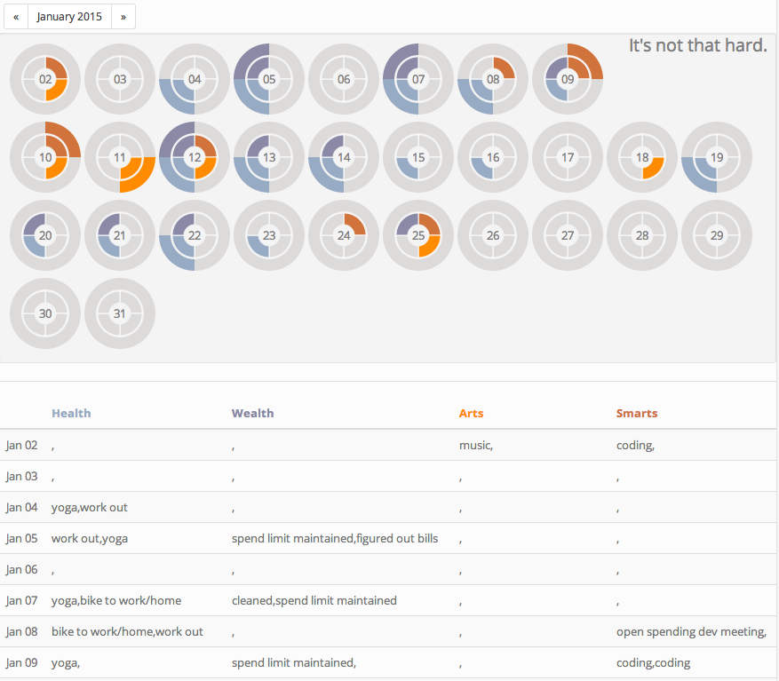

Okay, so I guess the idea behind this was to throw together a quick and dirty project (with D3?? are you nuts??) that 
essentially acts as a github choropleth map for life.  Or at least life goals.
Or maybe just "Things I'd Like To Make Sure I Keep Doing on a Consistent Basis".

The title comes from the fact that none of these activities is all that hard.
Figuring out a way to make them a consistent part of your routine though, is.  So this is a tool to try and do just that.

So obviously this thing was started right around new years, right?

